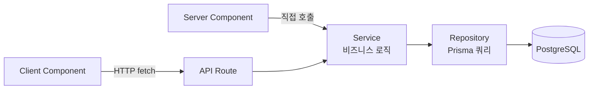
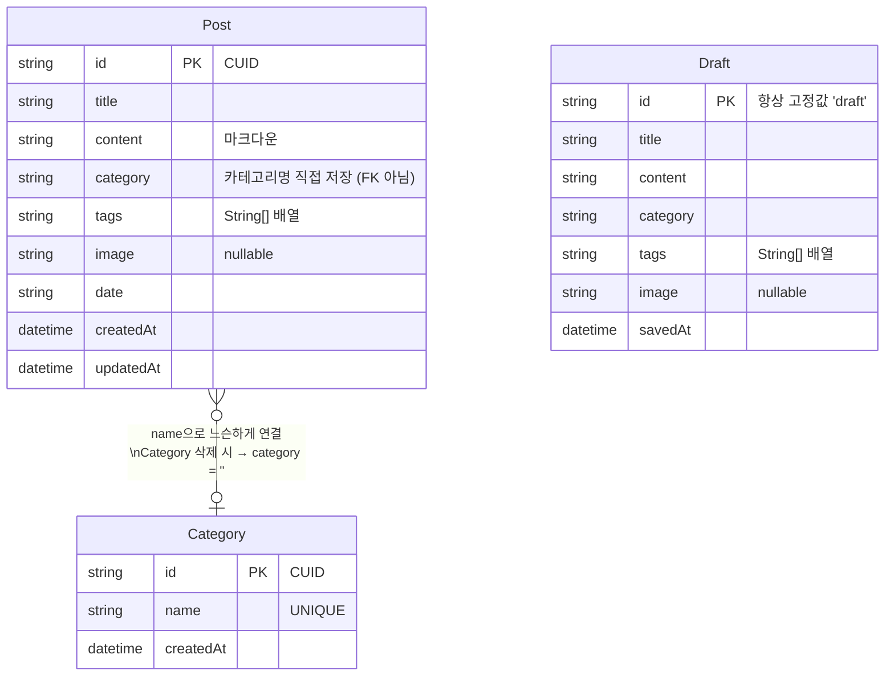
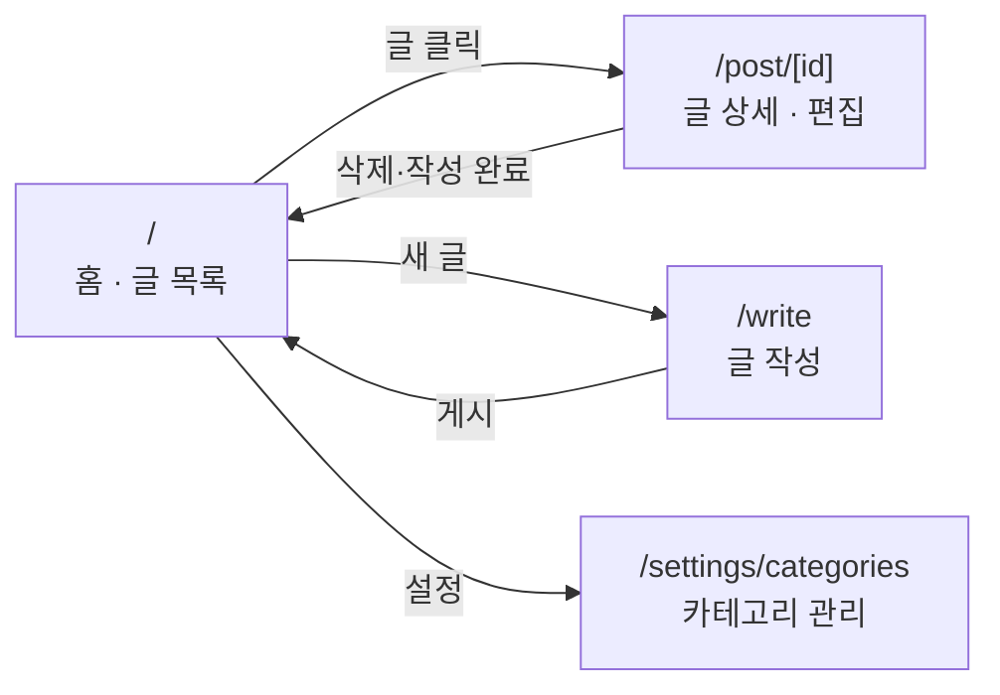
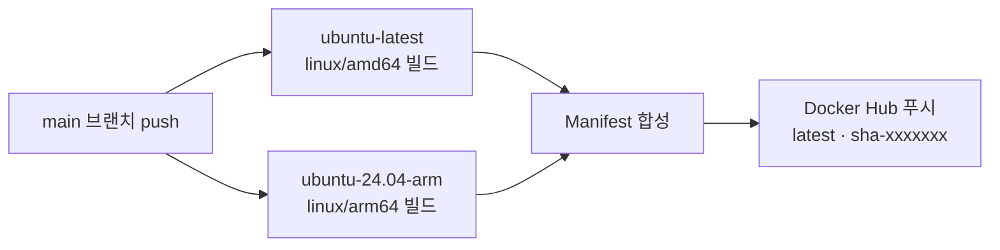

# RudyNote

배우고, 경험하고, 나누고 싶은 것들을 기록하는 개인 블로그.

## 기술 스택

| 분류 | 기술 |
|---|---|
| Framework | Next.js 16.2 (App Router) |
| UI | React 19, Tailwind CSS v4 |
| Editor | Milkdown Crepe v7 |
| ORM | Prisma v5 |
| Database | PostgreSQL 16 |
| Language | TypeScript 5 |
| Deployment | Docker, GitHub Actions |

---

## 아키텍처

```mermaid
flowchart TD
    Browser["브라우저"]

    subgraph Docker Compose
        subgraph Next.js App
            SC["Server Component\n(페이지)"]
            API["API Routes\n/api/**"]
            SA["Server Actions\ncreatePost · deletePost"]
        end
        DB[("PostgreSQL")]
    end

    subgraph GitHub
        GHA["GitHub Actions\nCI/CD"]
        Hub["Docker Hub\nlinux/amd64 · arm64"]
    end

    Browser -- "페이지 요청 (SSR/ISR)" --> SC
    Browser -- "글 수정·삭제·임시저장·카테고리\n(fetch)" --> API
    Browser -- "글 작성·삭제\n(redirect 필요)" --> SA

    SC -- "Service 직접 호출" --> DB
    API -- "Service → Repository" --> DB
    SA -- "Service → Repository" --> DB

    GHA -- "main push → 빌드 & 푸시" --> Hub
    Hub -- "docker compose pull" --> Next.js App
```

---

## 백엔드 레이어 구조



| 레이어 | 위치 | 책임 |
|---|---|---|
| **Server Component** | `app/**/page.tsx` | Service 호출 → props 전달 |
| **Client Component** | `components/**` | UI 렌더링, API fetch, 상태 관리 |
| **API Route** | `app/api/**` | 요청 검증, Service 호출, revalidatePath |
| **Service** | `lib/services/**` | 비즈니스 로직, 에러 throw |
| **Repository** | `lib/repositories/**` | Prisma 쿼리, 날짜 포맷 변환 |

---

## API 엔드포인트

| Method | Path | 설명 |
|---|---|---|
| `GET` | `/api/posts` | 전체 글 목록 |
| `POST` | `/api/posts` | 글 생성 |
| `GET` | `/api/posts/:id` | 글 단건 조회 |
| `PUT` | `/api/posts/:id` | 글 수정 |
| `DELETE` | `/api/posts/:id` | 글 삭제 |
| `GET` | `/api/draft` | 임시저장 조회 |
| `PUT` | `/api/draft` | 임시저장 저장/갱신 |
| `DELETE` | `/api/draft` | 임시저장 삭제 |
| `GET` | `/api/categories` | 카테고리 목록 |
| `POST` | `/api/categories` | 카테고리 추가 |
| `DELETE` | `/api/categories/:id` | 카테고리 삭제 |

응답 형식: 성공 `{ data }` / 실패 `{ error: { code, message } }`

---

## 데이터 모델



---

## 페이지 구조



---

## 주요 기능

### 글 목록 (홈)
- 전체 글 서버사이드 로딩 후 클라이언트에서 필터링 (`useMemo`)
- 제목·본문·태그 통합 검색, 검색어 하이라이트
- 카테고리 필터, 태그 필터 (복수 선택 가능)
- 작성 중인 임시저장 글이 있으면 상단 배너 표시

### 글 작성
- Milkdown 마크다운 에디터 (코드 하이라이트 포함)
- 제목, 카테고리, 날짜, 태그, 대표 이미지 설정
- **자동 임시저장** — 입력 후 2초 debounce로 `PUT /api/draft` 호출
- 페이지 재방문 시 임시저장 내용 자동 복원

### 글 상세 · 편집
- 수정 버튼 클릭 시 **인플레이스 편집** (페이지 이동 없음)
- 제목, 본문, 카테고리, 날짜, 태그 수정 → `PUT /api/posts/:id`
- 저장 실패 시 에러 메시지 표시
- `React.cache()`로 `generateMetadata`와 페이지 본문의 중복 DB 쿼리 제거

### 카테고리 관리
- 카테고리 추가(`POST /api/categories`) · 삭제(`DELETE /api/categories/:id`)
- 삭제 시 해당 카테고리를 사용 중인 글의 `category` 필드를 빈 문자열로 자동 초기화
- API 응답 기반 상태 업데이트 (낙관적 업데이트 없음)

---

## 로컬 개발

### 요구사항
- Node.js 20+
- PostgreSQL 실행 중

### 실행

```bash
# 1. 의존성 설치
npm install

# 2. 환경변수 설정
cp .env.example .env
# .env 에서 DATABASE_URL 수정

# 3. DB 마이그레이션
npx prisma migrate dev

# 4. 개발 서버 시작
npm run dev
```

브라우저에서 `http://localhost:3000` 접속

### 명령어

```bash
npm run dev                                  # 개발 서버 (Turbopack)
npm run build                                # 프로덕션 빌드
npm run lint                                 # ESLint 검사

npx prisma migrate dev --name <이름>         # 마이그레이션 생성 및 적용
npx prisma generate                          # Prisma 클라이언트 재생성
npx prisma studio                            # DB GUI
```

---

## Docker 배포

### 환경변수 설정

```bash
cp .env.example .env
```

| 변수 | 설명 |
|---|---|
| `DOCKERHUB_USERNAME` | Docker Hub 아이디 |
| `DATABASE_URL` | PostgreSQL 연결 문자열 |
| `NEXT_PUBLIC_SITE_URL` | 운영 도메인 (SEO, sitemap 기준 URL) |
| `POSTGRES_USER` | DB 계정 |
| `POSTGRES_PASSWORD` | DB 비밀번호 |
| `POSTGRES_DB` | DB 이름 |

### Docker Hub 이미지로 실행

```bash
docker compose pull
docker compose up -d
```

컨테이너 시작 시 `prisma migrate deploy`가 자동 실행됩니다.

### 로컬 빌드로 실행

`docker-compose.yml`의 `image:` 줄을 `build: .`으로 교체 후:

```bash
docker compose up --build -d
```

---

## CI/CD

`main` 브랜치에 push하면 GitHub Actions가 자동으로 Docker Hub에 이미지를 빌드 & 푸시합니다.



**필요한 GitHub Repository Secrets**

| Secret | 값 |
|---|---|
| `DOCKERHUB_USERNAME` | Docker Hub 아이디 |
| `DOCKERHUB_TOKEN` | Docker Hub Access Token (Read & Write) |

---

## 프로젝트 구조

```
src/
├── app/
│   ├── layout.tsx                      # 루트 레이아웃, 공통 metadata · OG · Twitter
│   ├── page.tsx                        # 홈 (ISR revalidate: 0)
│   ├── globals.css                     # Tailwind v4, Milkdown 스타일 오버라이드
│   ├── sitemap.ts                      # /sitemap.xml 동적 생성
│   ├── robots.ts                       # /robots.txt (/write, /settings 차단)
│   ├── api/
│   │   ├── posts/
│   │   │   ├── route.ts                # GET /api/posts, POST /api/posts
│   │   │   └── [id]/route.ts           # GET · PUT · DELETE /api/posts/:id
│   │   ├── draft/
│   │   │   └── route.ts                # GET · PUT · DELETE /api/draft
│   │   └── categories/
│   │       ├── route.ts                # GET /api/categories, POST /api/categories
│   │       └── [id]/route.ts           # DELETE /api/categories/:id
│   ├── post/[id]/
│   │   ├── page.tsx                    # 글 상세 (ISR + generateMetadata + React.cache)
│   │   └── PostDetailWrapper.tsx       # PostDetail dynamic import (ssr: false)
│   ├── write/
│   │   └── page.tsx                    # 글 작성 (force-dynamic)
│   └── settings/categories/
│       └── page.tsx                    # 카테고리 관리 (force-dynamic)
├── components/
│   ├── layout/Header.tsx
│   ├── post/
│   │   ├── PostFeed.tsx                # 클라이언트 필터링 (useMemo)
│   │   ├── PostList.tsx
│   │   ├── PostCard.tsx                # 검색어 하이라이트
│   │   └── PostDetail.tsx             # 상세 뷰 + 인플레이스 편집 (PUT /api/posts/:id)
│   ├── editor/
│   │   ├── MilkdownEditor.tsx          # Milkdown Crepe 래퍼 (ssr: false)
│   │   ├── WriteForm.tsx               # 작성 폼, 2초 debounce 자동 임시저장
│   │   └── DraftBanner.tsx             # 임시저장 배너 (DELETE /api/draft)
│   ├── filter/
│   │   ├── SearchBar.tsx
│   │   ├── CategoryFilter.tsx
│   │   └── TagFilter.tsx
│   ├── settings/CategoryManager.tsx    # 카테고리 CRUD (API fetch 기반)
│   └── ui/
│       ├── Button.tsx                  # primary · secondary · danger
│       └── TagBadge.tsx
└── lib/
    ├── db/index.ts                     # Prisma 싱글톤
    ├── api.ts                          # apiSuccess · apiError · handleError
    ├── errors.ts                       # NotFoundError · ConflictError · ValidationError
    ├── actions/
    │   └── posts.ts                    # createPost · deletePost (redirect 필요한 것만 유지)
    ├── services/
    │   ├── postService.ts              # 글 비즈니스 로직
    │   ├── draftService.ts             # 임시저장 비즈니스 로직
    │   └── categoryService.ts          # 카테고리 비즈니스 로직
    ├── repositories/
    │   ├── postRepository.ts           # Post Prisma 쿼리 + 날짜 변환
    │   ├── draftRepository.ts          # Draft Prisma 쿼리 + 날짜 변환
    │   └── categoryRepository.ts       # Category Prisma 쿼리 + 날짜 변환
    ├── readingTime.ts                  # readingTime() · summarize()
    └── highlight.ts                    # getHighlightParts()
```
